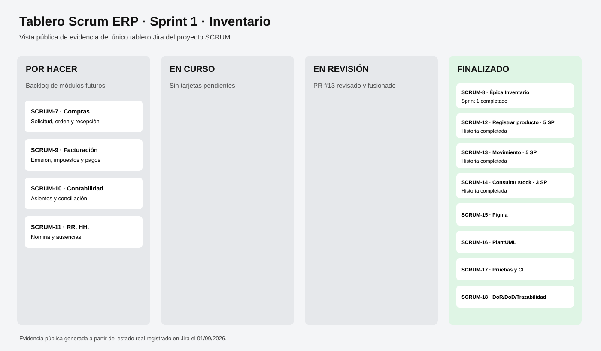

# Entrega pública · Taller Scrum ERP

Esta página reúne evidencias accesibles sin iniciar sesión.

## Evidencia del tablero Scrum

## Repositorio y código

- Repositorio público: https://github.com/ingalejandrotibaduiza-ai/miumb-sketch-martillo
- Código de Inventario: https://github.com/ingalejandrotibaduiza-ai/miumb-sketch-martillo/blob/main/src/inventario.py
- Diagramas PlantUML: https://github.com/ingalejandrotibaduiza-ai/miumb-sketch-martillo/tree/main/diagrams
- Pruebas: https://github.com/ingalejandrotibaduiza-ai/miumb-sketch-martillo/tree/main/tests
- DoR, DoD y trazabilidad: https://github.com/ingalejandrotibaduiza-ai/miumb-sketch-martillo/blob/main/docs/trazabilidad.md

## Flujo Git

- Pull Request #13: https://github.com/ingalejandrotibaduiza-ai/miumb-sketch-martillo/pull/13
- Issues del Sprint 1: https://github.com/ingalejandrotibaduiza-ai/miumb-sketch-martillo/issues
- GitHub Actions / CI: https://github.com/ingalejandrotibaduiza-ai/miumb-sketch-martillo/actions

## Historias del Sprint 1

- SCRUM-12 · Registrar producto · 5 SP
- SCRUM-13 · Registrar movimiento · 5 SP
- SCRUM-14 · Consultar stock · 3 SP

Todas quedaron integradas mediante el PR #13 y el CI terminó correctamente.

## Diseño UX/UI

El prototipo editable original está en Figma. Dependiendo de la configuración de Figma, el enlace original puede solicitar inicio de sesión. Para la entrega pública, la evidencia funcional y la descripción del flujo quedan documentadas en este repositorio.

Figma original: https://www.figma.com/design/bKDiVKHWbJTkElWHEXYL2N

## Jira original

El proyecto Jira conserva la trazabilidad real y los estados finales, pero Atlassian puede exigir autenticación según la configuración del sitio. La vista pública equivalente del tablero se incluye arriba como evidencia.
